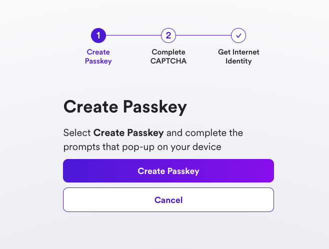
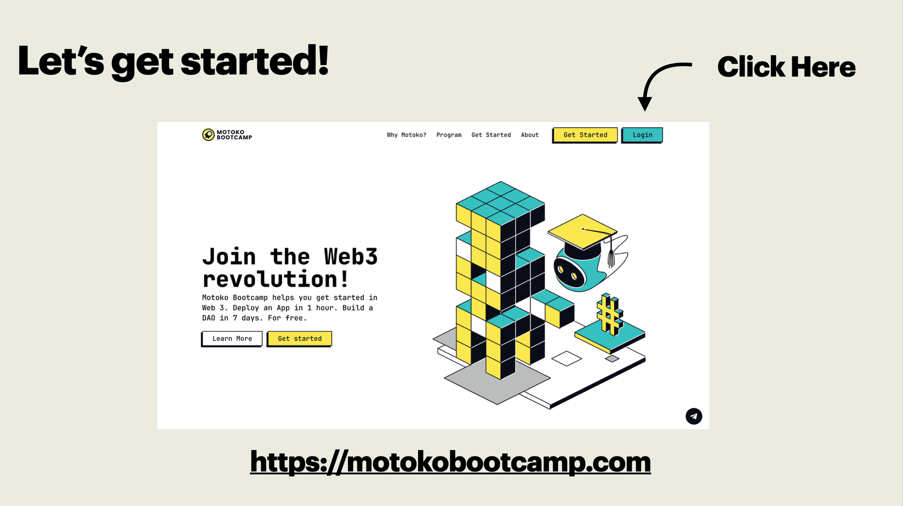
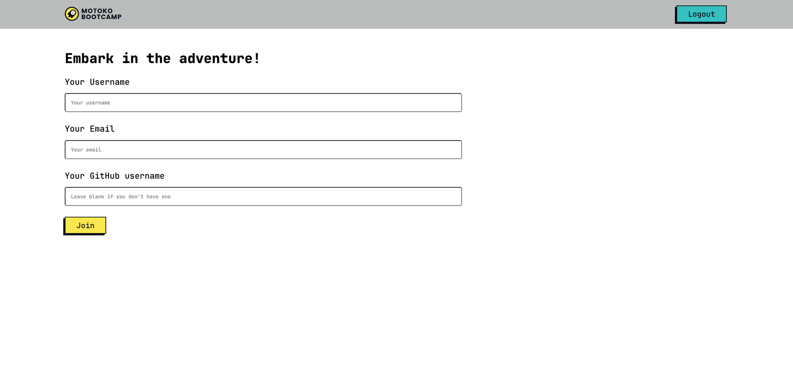

## Registration
To properly follow this course and record our progression - we need to register on the [Submission website](https://www.motokobootcamp.com/).

## Create an Internet Identity
To register on the Submission website and record your progression through this course, you need to own an Internet Identity. If you don't have one yet, you can create one by following the instructions on the [Internet Computer Wiki](https://wiki.internetcomputer.org/wiki/How_to_create_an_Internet_Identity).

 

## Register on the Submission website
Once you have your Internet Identity, login on the [Submission website](https://www.motokobootcamp.com/) - by clicking on the **Login** button in the top right corner and follow the instructions.

 

 

## Your first challenge! 

Let's dive in and tackle our first challenge right away! 