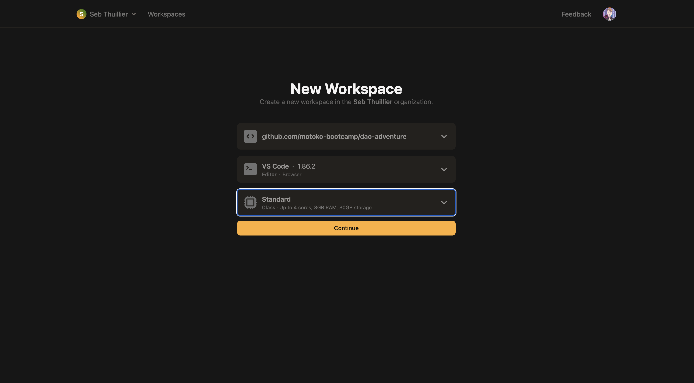
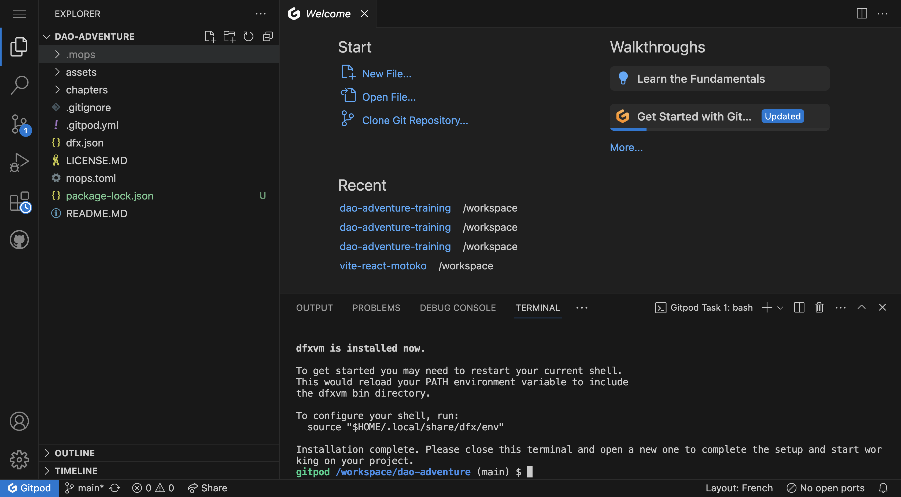
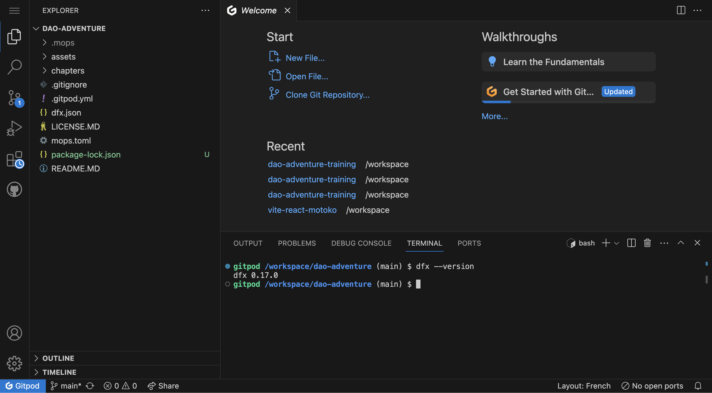
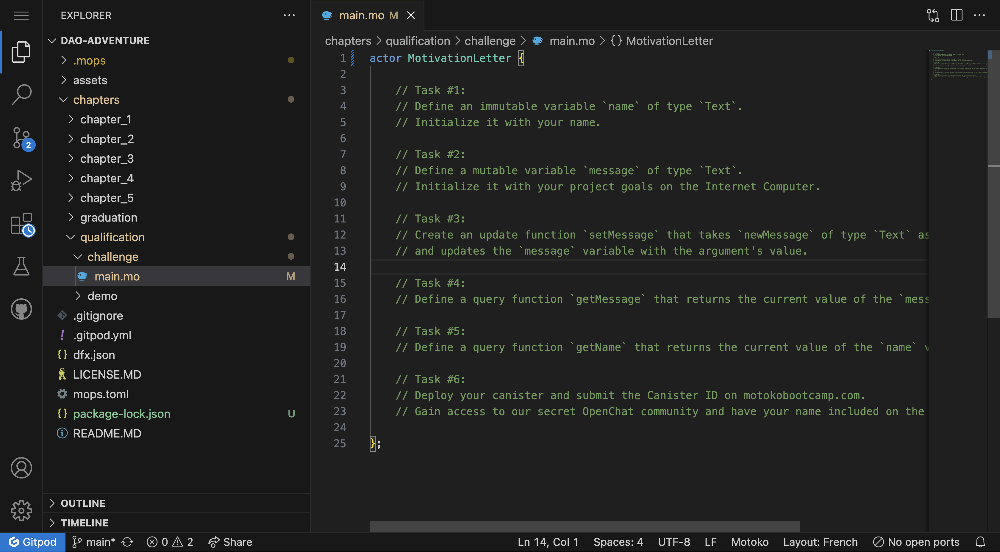

# Your first challenge
**"So you want to join the Motoko Bootcamp?"** 
Before joining us, you need to prove your worth by building and deploying 
your first application on the **Internet Computer**... let's do it.

## Setting up your environment

### Gitpod 
**GitPod** is a cloud-based development environment. We will use it to access and edit the project files directly your web browser. That way you don’t have to install any additional software or worry about setting up your development environment locally.

[](https://gitpod.io/#https://github.com/motoko-bootcamp/dao-adventure)

### Login 
To use **GitPod**, you'll need to authenticate with one of the following platforms:

- **GitLab** 
- **GitHub**
- **Bitbucket**


> If you lack these accounts, we suggest creating a GitHub account; it's quick, takes just 2 minutes, and is essential for your building journey!

With the free plan, we have up to 50 hours per month. This should be more than enough to complete the course.

### Create your workspace 
To continue you need to select the options for your workspace: 

- The repository
- The IDE
- The configuration



Continue with the following options: 

- The repository should be `dao-adventure`
- The IDE **VSCode** (Browser)
- The **standard** configuration.

### Setting up the workspace 
After installation, your files appear on the left, and the terminal displays "**Installation complete. Please close this terminal and open a new one to finalize the setup and begin your project.**" Open a new terminal by clicking "**+**" and close the current one.



Verify the workspace setup by running `dfx --version` in the newly open terminal.



> Facing issues when setting up the workspace? 

1. Try switching to another browser (Firefox is recommended)
2. Try to empty your cache and refresh the page.
3. Try using **Incognito Mode**.
4. If none of the above solves your issue, reach out on our feedback channel.

## Your first challenge 

Navigate to the folder `chapters/qualification/challenge` and open the `main.mo` file 



This is our first Motoko file, let's dive in!

### Writing a motivation letter

> A motivation letter, often known as a "statement of purpose," is a personalized document detailing an individual's aspirations, qualifications, and reasons for wanting to join a particular program or institution. 

This application will symbolically represent a **Motivation Letter**. You're not just creating an app; you're stepping into the transformative world of the Internet Computer.


### Demo 

To illustrate the next sections let's define a simple `actor Counter` - the code for this canister can be found in `chapters/qualification/demo/` folder.

```motoko
actor Counter {
    var counter : Nat = 0;
    let message : Text = "Motoko Bootcamp will become the best Web3 bootcamp in the world!";


    public func setCounter(newCounter : Nat) : async () {
        counter := newCounter; // We assign a new value to the counter variable based on the provided argument 
        return;
    };

    public func incrementCounter() : async () {
        counter += 1; // We increment the counter by one
        return; 
    };
    
    public query func getCounter() : async Nat {
        return counter;
    };
}
```

### Actor

Whenever you open a Motoko file, there is a high probability that the first word you encounter is `actor`:

```motoko
actor {

}
```
An **actor** is how a **canister** is defined in **Motoko**. This term comes from the [Actor model](https://doc.akka.io/docs/akka/current/typed/guide/actors-intro.html) - a theory on how to design systems that can handle multiple tasks concurrently.

Think of an **actor** as a small robot that can receive messages, do some work, and then send messages to other **actors**. **Actors** can also instantiate new **actors**. All the **actors** talk to each other by sending messages but they can't access the state of each other directly.

> For instance, an external canister looking to access the value of the current welcoming message would have to do it through a message - also called an inter-canister call.

You can choose to give your **actor** a name if you want, by writing the name right after the word `actor`.

```motoko
actor Counter {

}
```

### Variables and Types
Inside the body of the actor, we can define variables. In Motoko, variables are grouped into two categories: immutable and mutable.

- Immutable variables are variables that cannot be changed after they have been assigned a value. The `let` keyword is used to define an immutable variable in Motoko.

```motoko
let message : Text = "Motoko Bootcamp will become the best Web3 bootcamp in the world!";
```

> Task #1 - Define an immutable variable `name` of type `Text`. Initialize it with your name.

- Mutable variables are variables that can be changed after they have been assigned a value. The `var` keyword is used to define a mutable variable in Motoko.

```motoko
var counter : Nat = 0;
```

> Tast #2 -  Define a mutable variable `message` of type `Text`. Initialize it with an explanation of what you want to build with Motoko.

In Motoko, every variable has a specific type. This is a crucial aspect of Motoko because it helps avoid mistakes by ensuring that variables of different types cannot be combined or confused.

> For instance, you wouldn't be able to add a variable of type `Text` with a variable of type `Nat`.

The `:` specifies a variable's type. In our `Counter` example, we use `Text` for text strings and `Nat` for natural numbers (0, 1, 2, 3...), both built-in types in **Motoko**.

### Functions 
> In this project, we use only public functions accessible by anyone as part of the canister's public interface. Later, we'll cover how to define private functions.

Just like we had two types of variables - in Motoko we have two types of functions:

> The Counter is live on the Internet Computer, allowing you to interact with it via its [Candid UI]().

#### Update
Update calls modify a canister's state and require consensus from all nodes, resulting in a 2-3 second delay. Update  calls are used in these instances:

- Posting on social media, such as [DSCVR](https://dscvr.one/).
- Sending a message on a messaging application, such as [OpenChat](https://oc.app/).
- Buying a NFT on [Entrepot](https://entrepot.app/).

In Motoko, every function is an update function by default, unless specified otherwise using the `query` keyword (more on that in the next section).

```motoko
public func setCounter(newCounter : Nat) : async () {
    counter := newCounter; // We assign a new value to the counter variable based on the provided argument 
    return;
};
```

> Task #3 -  Create an update function `setMessage` that accepts a `newMessage` argument of type Text and updates the message variable with the provided argument's value. 

### Query
Query calls, ideal for reading data without altering state, are fast (about 200ms) since a single node can respond. However, they're less secure due to the risk of false information from malicious nodes. Query calls are used in scenarios like:

- Reading an article on [Nuance](https://nuance.xyz/).
- Checking your user profile picture on [DSCVR](https://dscvr.one/).
- Loading a video or a picture on any platform on [Taggr](https://taggr.link/)

In **Motoko**, we define `query` functions by using the `query` keyword.

```motoko
public query func getCounter() : async Nat {
    return counter;
};
```

> Task #4 -  Define a `query` function `getMessage`. This function returns the value of the `message` variable.

> Task #5 -  Define a `query` function `getName`. This function returns the value of the `name` variable.

### Deploying a Canister
To deploy a canister, we will use the `dfx` command line tool.

```bash
dfx deploy --playground counter
```

This command deploys the Counter canister to the **Internet Computer** using the `dfx.json` file. Within `dfx.json`, we specify the canister's name and the main Motoko's entry point. The entry point is the **Motoko** file hosting the `actor` along with public functions, forming the canister's public interface.
```json
{
  "canisters": {
    "counter": {
      "main": "src/qualification/demo/main.mo",
      "type": "motoko"
    }
  }
}
```

## Your turn! 

>  Task #6 -  To complete your qualification, deploy your canister and submit your ID on [motokobootcamp. com](https://www.motokobootcamp.com/)

Each canister deployed on the **Internet Computer** has an unique identifier called **Canister ID**. You need to identify the canister ID of your deployed application and submit it. 

